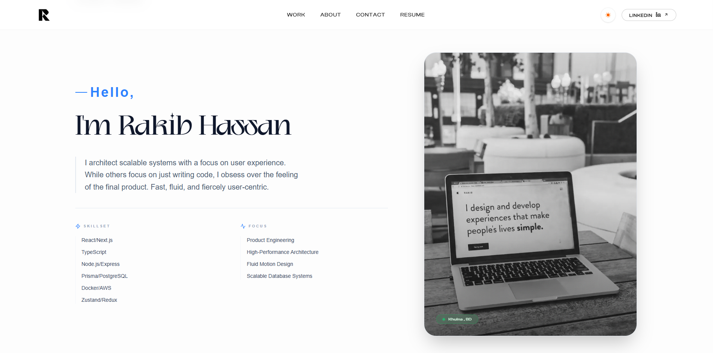

  

<h1 align="center">Rakib Hassan | Full-Stack Developer</h1>

  
  
  

---

## ⚡ Overview

I am a passionate **Full Stack Developer** specializing in building modern, high-performance web applications. This repository serves as a showcase of my skills in crafting clean, responsive, and user-centric digital experiences using the latest industry standards.

- 🚀 **Performance** Optimized for speed and responsiveness.
- 🎨 **Modern UI/UX** Focused on sleek, interactive designs.
- 🛠️ **Solid Engineering** Clean code and scalable architecture.

---

## 🛠️ Core Technologies

| Category | Tools & Frameworks |
| :--- | :--- |
| **Frontend** | React 19, Next.js 15, TypeScript |
| **Styling** | Tailwind CSS 4, Shadcn UI |
| **Animations** | Framer Motion |
| **Backend** | Node.js, Next.js Server Actions |
| **Integrations** | EmailJS, Lucide Icons |
| **Deployment** | Vercel |

---

## ✨ Features

- **Responsive Design**: Flawless experience across mobile, tablet, and desktop.
- **Interactive UI**: Smooth transitions and animations using Framer Motion.
- **Clean Architecture**: Modular components and well-structured code.
- **Performance First**: Leveraging Next.js 15's latest optimizations for LCP and SEO.

---

## 📫 Let’s Create Together

Feel free to reach out if you have a project in mind or just want to say hi!

- **Email**: [rakibcoding@gmail.com](mailto:rakibcoding@gmail.com)
- **Portfolio**: [rakibhassan.vercel.app](https://rakibhassan.vercel.app/)

  
  
  

  ⭐ <i>Thanks for visiting! Don't forget to star this repo if you find it helpful.</i> ⭐

